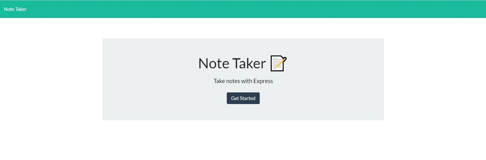
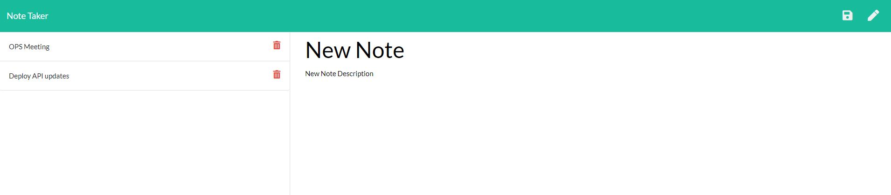

# Note-Taker

This Note-Taking application permits the user to be able to create, retrieve, and delete notes, every time a new note is created or deleted a JSON, that stores all the notes, is updated.
 
Note: Node.js application has been deployed in Heroku.

[Click here to go to Live Site](https://github.com/chernanma/Note-Taker)

[Click here to go to Repository](https://github.com/chernanma/Note-Taker)


---

## User Story

AS A user, I want to be able to create and delete notes

I WANT to be able to retrieve and delete a note that I have previously created

SO THAT I can track and organize all my TO-DOs

## Acceptance Criteria

Application should allow users to create and save notes.

Application should allow users to view previously saved notes.

Application should allow users to delete previously saved notes.

---

## Technologies

- Node.js
- Java Script
- Html
- JQuery

### Packages

- Express.js 

---

## Code 

``` JS
/**** server.js******/


// DEPENDENCIES
const express = require("express");

//Server configuration

const app = express();

// Sets an initial port. We"ll use this later in our listener
const PORT = process.env.PORT || 3030;

// Sets up the Express app to handle data parsing
app.use(express.urlencoded({ extended: true }));
app.use(express.json());
// app.use(express.static(path.join(__dirname, './public')));
app.use(express.static(__dirname + '/public'));


// ROUTER
// The below points our server to a series of "route" files.

require("./routes/apiRoutes")(app);
require("./routes/htmlRoutes")(app);


// LISTENER

app.listen(PORT, function() {
  console.log("App listening on PORT: " + PORT);
});


```

``` JS
/**** apiRoutes.js******/


// LOAD DATA

const notesStore = require("../db/store");

// ROUTING

module.exports = function(app) {
  // API GET Requests
  
  //Display notes

  app.get("/api/notes",notesStore.display);
 
 // Create new Note

  app.post("/api/notes", notesStore.add);

// Delete Note base on Id number

  app.delete("/api/notes/:id", notesStore.delete);
 
}

```

``` JS
/**** htmlRoutes.js******/


// DEPENDENCIES
var path = require("path");

// ROUTING

module.exports = function(app){

  app.get("/notes", function(req, res) {
    res.sendFile(path.join(__dirname, "../public/notes.html"));
  });

  app.get("*", function(req, res) {
    res.sendFile(path.join(__dirname, "../public/index.html"));
  });
  
};

```

## Screenshots

### Home Page



### Notes Page 



---
## References

- The Node.js fs module, https://nodejs.dev/learn/the-nodejs-fs-module

- Express , https://expressjs.com/


